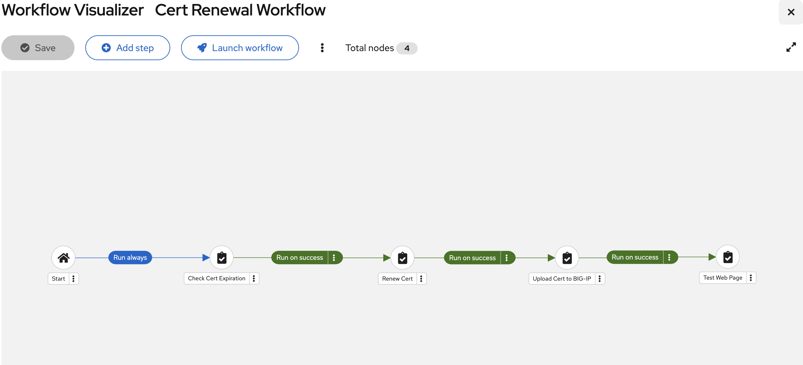

# managing-certificate-lifecycle-acme
This repo includes ansible playbooks for a demo project of automating certificate lifecycle management using [ACME protocol](https://en.wikipedia.org/wiki/Automatic_Certificate_Management_Environment) with Red Hat Ansible Automation Platform on AWS EC2. This also includes ansible playbooks and roles for setting up the demo environment above mentioned.

## Assumed demo environment
The demo environment looks like the following:


|Component|Description|
|:--------|:----------|
|BIG-IP LTM (ltm01)|Load balancer that terminates HTTPS traffic and distributes requests to backend.|
|NGINX (web01)|Web server which hosts the actual web site.|
|Vault (vault01)|HCP Vault stores certificates, keys, and secrets that were issued by an external CA.|
|AAP (aap01)|AAP integrates and orchestrates the certificate management workflow.|
|Let's Encrypt|ACME capable Certificate Authority (CA).|


To set up the environment, please refer to [SETUP.md](./SETUP.md).

## Included contents
### Playbooks
|Name     |Description|
|:--------|:----------|
|`check_cert_vault.yml`|Check the certificate in the Vault and determine if it is expired.|
|`renew_acme_cert.yml`|Renew the certificate and store it in the Vault.|
|`upload_cert_ltm.yml`|Upload the renewed certificate to BIG-IP LTM.|
|`test_cert_ltm.yml`|Test if the certificate is successfully updated.|

### Group variables
These variables have already been set as follows, corresponding to the setup through the procedure [SETUP.md](./SETUP.md). You can adjust them based on your environment.
```
---
domain_name: "www.yourdomain.net" # adjust with your domain
country_name: "JP" # adjust with your preference
organization_name: "yourorg" # adjust with your preference
organizational_unit_name: "Dev" # adjust with your preference

acme_email: "admin@{{ domain_name }}" # adjust with your preference
acme_directory: "https://acme-v02.api.letsencrypt.org/directory" # adjust with your preference

files_loc: ./cert-store # adjust with your preference
le_private_key: "{{ files_loc }}/le-account.key" # adjust with your preference
csr_private_key: "{{ files_loc }}/{{ domain_name }}/{{ domain_name }}.key" # adjust with your preference
cert_remaining_days: 30

vault_addr: "https://yourdomain.net:8200" # your vault URI
vault_token: "hvs.hogehogehoge" # token for your vault
vault_namespace: "admin"
vault_mount: "cert-store" # adjust with your preference
vault_cert_path: "{{ domain_name }}"

```

## Execution environment
### Prepare a container image
This demo requires creating a custom execution environment (container image). You can build your container image by using [ansible-builder](https://docs.redhat.com/en/documentation/red_hat_ansible_automation_platform/2.6/html/creating_and_using_execution_environments/assembly-using-builder).

First, prepare an ansible-builder installed environment. The rasiest way here is using the AAP VM for this purpose. Then, you can build the image using [execution-environment.yml](./ee-demo/execution-environment.yml).
```
$ mkdir $HOME/ee-demo
$ cd $HOME/ee-demo/
$ cp execution-environment.yml $HOME/ee-demo/

$ ansible-builder build --build-arg PYCMD=/usr/bin/python3.11 -t ee-demo-rhel9
```
DO NOT forget to add `--build-arg PYCMD=/usr/bin/python3.11`.

After building the container image, you need to push the image to the deployed Automation Hub. 
```
$ podman login your-automation-hub-address

$ podman image tag ee-demo-rhel9 your-automation-hub-address/ee-demo-rhel9:latest
$ podman push --tls-verify=false your-automation-hub-address/ee-demo-rhel9:latest
```
You can determine your Automation Hub address through the following steps:

1. Log in to your Ansible Automation Platform.
2. Go to Automation Content > Execution Environment.
3. Click `Push container images` button.
4. Copy `podman login ...` command line.

Once you push the container image to your Automation Hub, you would find the container image in the Execution Environment page.

### Set up the execution environment
Once the execution environment gets available in your Automation Hub, next you need to make it usable in your Automation Controller.

1. Go to Automation Execution > Execution Environment.
2. Click `Create execution environment` button.
3. Enter the following fields:
   - Name: `Demo execution environment`
   - Image: `your-automation-hub-address/ee-demo-rhel9:latest`
   - Pull: `Only pull the image...`
   - Organization: `Default`
4. Click `Create execution environment` button.

Now, the `Demo execution environment` gets ready.


## Installation and usage
Assuming the demo environment has been already created by the way of before mentioned and you've also performed `git clone` this repo.

### Manually
Ensure that you are logged in to your Ansible Automation Platform before proceeding with the following steps.

### Create custom credential types
At least the following three custom credential types need to be defined. Go to Automation Execution > Infrastructure.

#### Credential type for Hashicorp Vault Token
1. Click `Credential Types` in the left menu.
2. Click `Create credential type` button.
3. Enter the following fields:
   - Name: `Hashicorp Vault Token`
   - Input configuration:
   ```
   fields:
     - id: vault_token
       type: string
       label: Hashicorp Vault Token
       secret: true
   ```
   - Injector configuration:
   ```
   env:
     VAULT_TOKEN: '{{ vault_token }}'
   ```
4. Click `Save credential type` button.

#### Credential type for Letsencrypt Account Key
1. Click `Credential Types` in the left menu.
2. Click `Create credential type` button.
3. Enter the following fields:
   - Name: `Letsencrypt Account Key`
   - Input configuration:
   ```
   fields:
     - id: le_private_key
       type: string
       label: Letsencrypt Private Key
       secret: true
       multiline: true
   ```
   - Injector configuration:
   ```
   env:
     LE_PRIVATE_KEY: '{{ le_private_key }}'
   ```
4. Click `Save credential type` button.

#### Credential type for BIG-IP LTM Password
1. Click `Credential Types` in the left menu.
2. Click `Create credential type` button.
3. Enter the following fields:
   - Name: `BIG-IP LTM Password`
   - Input configuration:
   ```
   fields:
     - id: ltm_passwd
       type: string
       label: BIG-IP LTM admin password
       secret: true
   ```
   - Injector configuration:
   ```
   env:
     LTM_PASSWD: '{{ ltm_passwd }}'
   ```
4. Click `Save credential type` button.

Please refer to [Ansible Doc](https://docs.redhat.com/en/documentation/red_hat_ansible_automation_platform/2.6/html/using_automation_execution/assembly-controller-custom-credentials) for more details.

### Create credentials
At least the following four credentails need to be defined. Go to Automation Execution > Infrastructure.

#### Credential for AWS
1. Click `Credentials` in the left menu.
2. Click `Create credential` button.
3. Enter the following fields:
   - Name: `aws_cred`
   - Organization: `Default`
   - Credential Type: `Amazon Web Services`
   - Access Key: your AWS_ACCESS_KEY_ID
   - Secret Key: your AWS_SECRET_ACCESS_KEY
4. Click `Save credential` button.

#### Credential for Vault Token
1. Click `Credentials` in the left menu.
2. Click `Create credential` button.
3. Enter the following fields:
   - Name: `vault_token`
   - Organization: `Default`
   - Credential Type: `Hashicorp Vault Token`
   - Hashicorp Vault Token: your Token (Initial Root Token)
4. Click `Save credential` button.

#### Credential for Letsencrypt Account Key
1. Click `Credentials` in the left menu.
2. Click `Create credential` button.
3. Enter the following fields:
   - Name: `le_account_key`
   - Organization: `Default`
   - Credential Type: `Letsencrypt Account Key`
   - Hashicorp Vault Token: your Account Key
4. Click `Save credential` button.

NOTE: When creating a certificate first, you will also generate an ACME account key as a file. In order to input this key field, copy the content of the above key file **base64 encoded**.

#### Credential for BIG-IP LTM Password
1. Click `Credentials` in the left menu.
2. Click `Create credential` button.
3. Enter the following fields:
   - Name: `ltm_passwd`
   - Organization: `Default`
   - Credential Type: `BIG-IP LTM Password`
   - Hashicorp Vault Token: your admin password for BIG-IP
4. Click `Save credential` button.

Please refer to [Ansible Doc](https://docs.redhat.com/en/documentation/red_hat_ansible_automation_platform/2.6/html/using_automation_execution/controller-credentials) for more details.


### Create inventories
Go to Automation Execution > Infrastructure.

1. Click `Inventories` in the left menu.
2. Click `Add` button and select `Add inventory`.
3. Enter the following fields:
   - Name: `ACME_Demo`
4. Click `Save` button and then select `Sources` tab.
5. Click `Add` button.
6. Enter the following fields:
   - Name: `AWS`
   - Source: `Amazon EC2`
   - Credential: `aws_cred`
   - Update options: `Overwrite`, `Overwrite variables`, `Update on launch`
   - Source variables:
   ```
   ---
   # Minimal example using environment variables
   # Fetch all hosts taged with "purpose" tag as "demo" in ap-northeast-1
   
   plugin: amazon.aws.aws_ec2
   keyed_groups:
     - prefix: tag
       key: tags

   # Change regions corresponding to your environment
   regions:
     - ap-northeast-1 # adjust with your preference

   # Filter only objects taged with "purpose" tag as "demo"
   filters:
     tag:purpose: acme_demo

   # Ignores 403 errors rather than failing
   strict_permissions: false
   ```
7. Click `Save` button.


### Create a project
Go to Automation Execution > Infrastructure.

1. Click `Projects` in the left menu.
2. Click `Add` button.
3. Enter the following fields:
   - Name: `Cert_Lifecycle_Demo`
   - Organization: `Default` (or your prefered organization)
   - Execution Environment: `Demo execution environment`
   - Source Control Type: `Git`
   - Source Control URL: your git repositoriy
4. Click `Save` button

Please refer to [Ansible Doc](https://docs.redhat.com/en/documentation/red_hat_ansible_automation_platform/2.6/html/using_automation_execution/controller-projects#proc-controller-adding-a-project) for more details.

### Create job templates
Each job template is equivalent to a playbook in this repository. Repeat these steps for each template/playbook that you want to use and change the variables specific to the individual playbook. Please refer to [Ansible Doc](https://docs.redhat.com/en/documentation/red_hat_ansible_automation_platform/2.6/html/using_automation_execution/controller-job-templates) for more details.

1. Click `Templates` in the left menu.
2. Click `Create template` button and select `Create job template`.
3. Follow the next steps respectively.
4. Click `Create job template` button

#### Check Cert Expiration
- Name: `Check Cert Expiration`
- Job Type: `Run`
- Inventory: `ACME_Demo`
- Project:  `Cert_Lifecycle_Demo`
- Playbook: `check_cert_vault.yml`
- Execution environment: `Demo execution environment`
- Credentials: `vault_token`
- Extra variables:
  ```
  vault_addr: https://yourvaultaddress:8200
  ```
Once the job template is created, add the following survey and enable it.
- Question: `Remainning Days?`
- Answer variable name: `cert_remaining_days`
- Answer type: `Integer`
- Options: `Required`
- Default answer: `30`


#### Renew Cert
- Name: `Renew Cert`
- Job Type: `Run`
- Inventory: `ACME_Demo`
- Project:  `Cert_Lifecycle_Demo`
- Playbook: `renew_acme_cert.yml`
- Execution environment: `Demo execution environment`
- Credentials: `aws_cred`, `vault_token`
- Extra variables:
  ```
  vault_addr: https://yourvaultaddress:8200
  ```

#### Upload Cert to BIG-IP
- Name: `Upload Cert to BIG-IP`
- Job Type: `Run`
- Inventory: `ACME_Demo`
- Project:  `Cert_Lifecycle_Demo`
- Playbook: `upload_cert_ltm.yml`
- Execution environment: `Demo execution environment`
- Credentials: `ltm_passwd`, `vault_token`
- Extra variables:
  ```
  vault_addr: https://yourvaultaddress:8200
  ```

#### Test Web Page
- Name: `Test Web Page`
- Job Type: `Run`
- Inventory: `ACME_Demo`
- Project:  `Cert_Lifecycle_Demo`
- Playbook: `test_cert_ltm.yml`
- Execution environment: `Demo execution environment`


### Create a workflow template
Follow the next steps for creating an integrated workflow. Please refer to [Ansible Doc](https://docs.redhat.com/en/documentation/red_hat_ansible_automation_platform/2.6/html/using_automation_execution/controller-workflow-job-templates) for more details.

#### Cert Renewal Workflow

1. Click `Templates` in the left menu.
2. Click `Create template` button and select `Create workflow job template`.
3. Enter the following fields.
   - Name: `Upload Cert to BIG-IP`
   - Organization: `Default`
   - Inventory: `ACME_Demo`
   - Extra variables:
     ```
     vault_addr: https://yourvaultaddress:8200
     ```
4. Click `Create workflow job template` button
5. Configure the workflow template as follows:

   

1. Click `Save` button.
